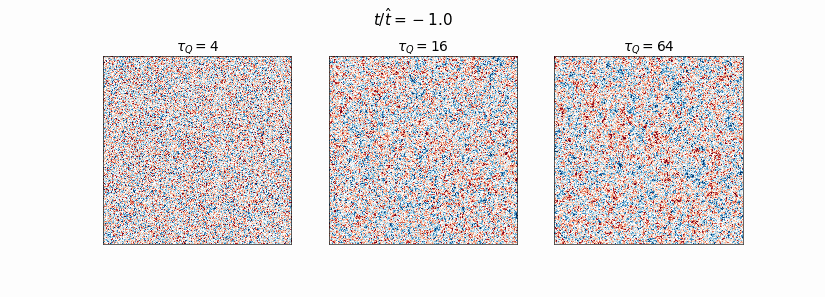
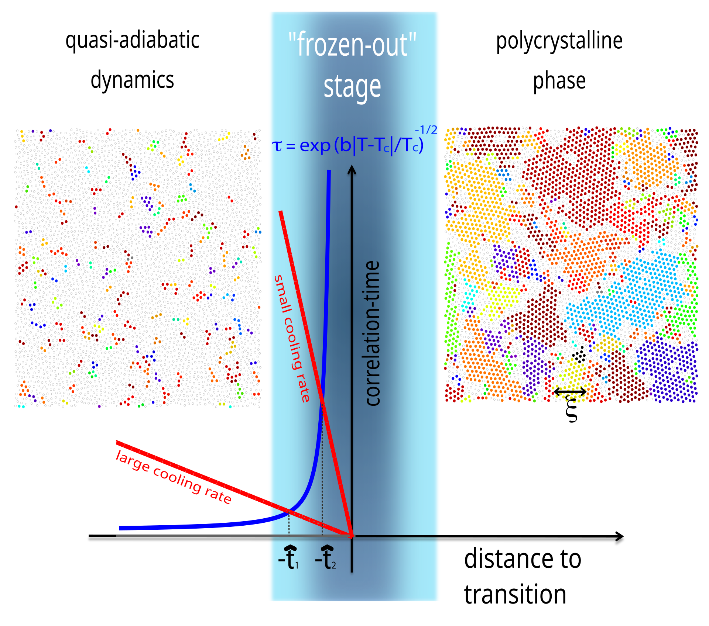
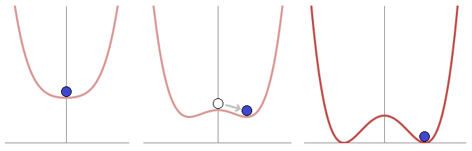

# Neural-Network Prediction of Defect Formation in Quenched $\phi^4$ models.

  
   
  <em>2D quench at different quench times, shown at the same rescaled times t/t̂. Larger τQ gives larger domains.</em>

Second order phase transitions are caused by the breaking of some symmetry in a physical system. The dynamics that govern a system that is driven through a second order phase transition at some finite speed is known as *Kibble-Zurek physics*. Kibble-Zurek physics predicts that as the system is driven in this non-equilibrium process, the symmetry in a system is broken in different ways across the system. In this repository we explore how one can use machine learning to gain a deeper insight of this non-equilibrium process. 

Recently work has been done on trying to understand the non-equilibrium dynamics that form these domains. A work led by ____ [REFERENCE] studied the KZ effect in one dimension, finding that deep within the "freezout" regime there exists enough information to intuit the final domain pattern. 

We begin by replicating results from [REFERENCE], then we extend beyond their work to produce new results in the 2D case, and discuss what is similar and different in the one and two dimensional cases. This also gives us an insight in how to use machine learning as a tool to discover new physics.

  
   
  <em>The transition of some general disordered model to some crystalline phase. The blue line denotes how long one needs to wait for thermalization. The red lines indicate the cooling rate. The x value at which these two curves intersect is known as the "freezout time" $\hat t$. The classical understanding of KZ mechanism is that dynamics is "frozen out" in the time $t\in [-\hat t , \hat t]$ </em>

# Background

  
   
  <em>The minimum of the "mexican hat potential" spontaneously takes on a non-zero value as the paramater $\epsilon(t)$ is varied.</em>

Phase transitions in physical systems are associated with a spontaneous symmetry breaking. For instance, consider the figure above. On the left, we see that the minimum of the curve in red is in the center. Now imagine we deform the curve as shown. Suddenly, there are now two minima in the function where previously there was only one. 

Physical systems want to minimize their potential energies in a way that satisfy their kinematical constraints. That's a fancy way of saying that the ball prefers to sit in the minimum of the well. So when there are two degenerate minima, the ball simply has to pick one to fall in. Both divots lower the balls potential energy by the same amount, but *the fact that there is a choice at all for the ball* means the physics of the resulting situation is very different than when we had one minimum. 

The critical point of a system is the point at which symmetry is just about to be broken. At this point, the system becomes ultra-sensitive to thermal (for classical systems) fluctuations. The change in the value of the field at one point has immense influence on the strength of the field at a far away point. To describe this long range sensitivity, we say that the system's *correlation length* "diverges" at the critical point, in other words, we formally say its infinite. 

Correlation length can be thought of as the length of an area that has settled into the same value of field strength. However, to equilibriate an area of size $\xi$, one needs to wati a period of time proportional to the size of the area being considered, in other words, in orderto wait for a thermodynamically large system to equilibriate at the critical point, you'd have to wait an infinite amount of time!

This implies that any finite speed phase transition-- in other words, you drive the system across the critical point in some time that doesn't take an inifnite amount of time-- is inherently a non-equilibrium process. This non-equilibrium behavior comes in the form of heat energy added in by your quench, and is observable in the post-quench field configuration as topological defects that raise the energy of the system above its ground state. 

The density of these topological defects famously follows a power law, $\xi\propto v^k$, where $v$ is the velocity of the quench and $k$ is some real number. Knowing the value of $k$ is very important for physcisists, as one can relate it to the scaling epxonents of a system. In other words, measuring $k$ in this non-equilibrium experiment gives us access to an equilibrium scaling exponent.

To do:

rename files []

comment all files []

Clear figures for 2D, 1D []

README explanation, citations ,etc []

kz.py - 1D phi_4 model code (Originally KZ.py, needs updating)

kz_ml.py - 2D UNET trainer for the 2d phi_4 

KZ_2D.py 