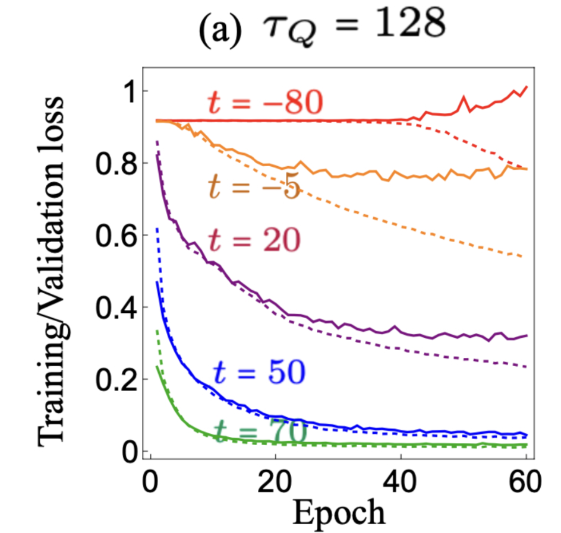

# Neural-Network Prediction of Defect Formation in Quenched $\phi^4$ models.

  
   
  <em>2D quench at different quench times, shown at the same rescaled times t/t̂. Larger τQ gives larger domains.</em>

Second order phase transitions are caused by the breaking of some symmetry in a physical system. The dynamics that govern a system that is driven through a second order phase transition at some finite speed is known as *Kibble-Zurek physics*. Kibble-Zurek physics predicts that as the system is driven in this non-equilibrium process, the symmetry in a system is broken in different ways across the system. In this repository we explore how one can use machine learning to gain a deeper insight of this non-equilibrium process. 

Recently work has been done on trying to understand the non-equilibrium dynamics that form these domains. A work led by ____ [REFERENCE] studied the KZ effect in one dimension, finding that deep within the "freezout" regime there exists enough information to intuit the final domain pattern. 

We begin by replicating results from [REFERENCE], then we extend beyond their work to produce new results in the 2D case, and discuss what is similar and different in the one and two dimensional cases. This also gives us an insight in how to use machine learning as a tool to discover new physics.

  
   
  <em>The transition of some general disordered model to some crystalline phase. The blue line denotes how long one needs to wait for thermalization. The red lines indicate the cooling rate. The x value at which these two curves intersect is known as the "freezout time" $\hat t$. The classical understanding of KZ mechanism is that dynamics is "frozen out" in the time $t\in [-\hat t , \hat t]$ </em>

# Background

  
   
  <em>The minimum of the "mexican hat potential" spontaneously takes on a non-zero value as the paramater $\epsilon(t)$ is varied.</em>

Phase transitions in physical systems are associated with a spontaneous symmetry breaking. For instance, consider the figure above. On the left, we see that the minimum of the curve in red is in the center. Now imagine we deform the curve as shown in the diagram. We see that suddenly, there are now two minima in the function where previously there was only one. 

The red curve represents the potential energy of the ball. Physical systems want to minimize their potential energies in a way that satisfy their kinematical constraints. That's a fancy way of saying that the ball prefers to sit in the minimum of the well. So when there are two degenerate minima, the ball simply has to pick one to fall in. Both divots lower the balls potential energy by the same amount, but *the fact that there is a choice at all for the ball* means the physics of the resulting situation is very different than when we had one minimum. 

The critical point of a system is the point at which symmetry is just about to be broken. At this point, the system becomes ultra-sensitive to thermal fluctuations (The situation is slightly different in quantum systems, which we do not consider here). The change in the value of the field at one point has immense influence on the strength of the field at a far away point. To describe this long range sensitivity, we say that the system's *correlation length* "diverges" at the critical point, in other words, we formally say its infinite. 

Correlation length can be thought of as the size of an area that has settled into the same value of field strength. However, to equilibriate an area of size $\xi$, one needs to wait a period of time proportional to the size of the area being considered. This means that if our correlation length is infinite, then we need to wait an infinite amount of time for our system to equilibriate! 

This implies that any finite speed phase transition (in other words, you drive the system across the critical point in some time that doesn't take an inifnite amount of time) is inherently a non-equilibrium process. Physically, heat energy is injected into the system by the finite speed quench. This heat is observable in the post-quench field configuration as topological defects that raise the energy of the system above its ground state. 

The density of these topological defects famously follows a power law, $\xi\propto v^k$, where $v$ is the velocity of the quench and $k$ is some real number. Knowing the value of $k$ is very important for physcisists, as one can relate it to the scaling epxonents of a system. In other words, measuring $k$ in this non-equilibrium experiment gives us access to an equilibrium scaling exponent.

We study a $\phi^4$ model with the following lagrangian:

$$\mathcal{L}=\frac{1}{2}\dot \phi -\frac{1}{2}(\nabla \phi)^2-V(\phi)$$

with 

$$V(\phi)=\frac{1}{8}(\phi^4-\epsilon(t)\phi ^2)

$$

Noise and temperature require an outisde bath, which is modeled through a langevin extension to hte equation sof motion:

$$\ddot \phi + \eta \dot \phi - \nabla^2 \phi +V'(\phi)=\zeta(r,t)$$

Where $\zeta$ is our noise kernel satisfying:

$$\langle \zeta(r,t) \zeta(r',t') \rangle =2\eta \theta \delta^d(r-r')\delta(t-t')$$

The parameter of interest here is $\epsilon(t)$, which controls whether or not $V(\phi$) has one or two minima (In fact, $V(\phi)$ is exactly the mexican hat potential in the image above!)

We choose $\epsilon(t)=t/\tau$, so that if we run an experiment for instance from $t=-3\tau \to 10\tau$ we are varying $\epsilon$ from -3 to 10 at a constant velocity $v=1/\tau$.

This picture is quite general. In this repository we consider the case of one and two dimension seperately. In two dimensions, we can also have coarsening dynamics, where regions of phase set by the kibble zurek dynamics, but then after this formation they can move, shrink, or grow. Oftentimes, anything that goes byeond mean-defect density is considered "beyond KZ physics". In this case, we aim to predict the entire field configuration, which is definitely beyond KZ physics!

# Results
### 1D replication study

We aim initially to replicate the results of [REFERENCE]. We simulate the dynamics of the system in one dimenison and train a Recurrent-Neural-Network to take in a snapshot of the field and predict the final field configuration.

  
   
  <em>Top: The real time evolution of the one dimensional field $\phi$ for a specific noise realization. Regions of positivity and negativity are evidence of the KZ dynamcis. These regions grow increasingly polarized as the minimum depth $\propto \sqrt{\epsilon}$ is increased. Bottom: The finial field configuration for this trajectory, with defects counted as zero-crossings of the field. The job of our RNN is to predict hte bottom plot given the top plot.</em>

You can train the model yourself, using `notebook.01_1d_replication.ipynb`. If you do, you'll find a result similar to this:

  
   
  <em>The (normalized) field input in blue, the true final field in black, and our RNN's prediction of the final field in Red. As we can see, the model is not only capable of learning the final number of defects, but is also capable of predicting defect location!</em>

  
   
  <em>Location of defects versus the prediction by the model</em>

In direct comparison with some of the figures in [Reference], we find that we replicate their results to a sufficient level of satisfaction. For instance, observe the training/validation curves we recover to the ones reported by them.

  
  
   
  <em>Left: Our result Right: [REFERENCE] result.</em>

#### Going Beyond the paper

Before continuing onto the two dimensional case, we first ask (as we will ask throughout this project): What is the model really learning? 

To help answer this question, we apply a low-pass filter to the inputs before asking our model to predict the final field values. KZ physics tells us that length scales less than $\xi_{KZ}$ (and hence, momentum modes larger than $k=\frac{1}{\xi_{KZ}}$) should be irrelevant to the final field configuration.

In applying a low pass filter, we are selecting to keep only momentum modes $k\in [0,k_c]$ where $k_c$ is a cutoff frequency.

We find that for $k_c\le \frac{1}{\xi_{KZ}}$, validation error greatly increases, but for $k_c\ge\frac{1}{\xi_{KZ}}$ is flat! The RNN is only learning features on the scale of the Kibble-Zurek length!

  
   
  <em>Validation errors against $k_c$cutoff frequency. </em>

## 2D Kibble Zurek Physics

In two dimensions, there are different dynamical constraints at play in the evolution of the system. Now, defects form as two-dimensional areas of like-domain size.

This can be seen in the animation at the top of this page. We now want to ask the same question, where is the information in this quench? Does it change in two dimensions? Do effects like coarsening effect our dynamics? What does our model really end up learning?

To start, we examine a single image snapshot of the field $\phi$ at a single snapshot in time. We ask ourselves how much of the final field is already held in this image? 

Before using machine learning, it would be nice to establish a baseline of what we can assume about the dynamics from a snapshot. The most mild assumption we can make is that the field diffuses uniformly.

  
   
  <em>A gaussian blur filter can reduce error in even a very disorderd state. </em>

We directly compare the error of the best-blur filter with the fitting results of our NN. 

  
   
  <em>We compare the baseline error (blue) to the diffusive filter (orange) and our model (green). We see that the filter plateaus in its ability to predict the dynamics where the model is able to learn to predict the final distribution. At very disordered cases, the model can only learn the filter itself.  </em>

# Repository Structure

In `/src/` we have functions for generating the $\phi$ field ( `kz.py`, `kz_2d.py`) and for the subsequent analysis (`kz_ml.py`, `analysis.py`). Scripts for generating the fields in large batches suitable for machine learning purposes are found in `/scripts/kz1d/` and `/scripts/kz2d/` respectively. Each folder also has a respective `train.py` for impleneting a RNN or UNET respectively for either the 1D or 2D case. 

We provide a series of interactive Jupyter Notebook files that walk a reader through the experiments, and subsequent training and machine learning results.

# References 

[]

