# Neural-Network Prediction of Defect Formation in Quenched $\phi^4$ models.

<p align="center">
  
  <br>
  <em>2D quench at different quench times, shown at the same rescaled times t/t̂. Larger τ<sub>Q</sub> gives larger domains.</em>
</p>

## Overview

When a system is driven through a symmetry-breaking phase transition at a finite rate, the symmetry in the system is not broken uniformly throughout the system but instead forms domains of broken-symmetry states characterized by defects in the system. The Kibble-Zurek (KZ) mechanism predicts the typical size of these domains, but not any other higher order spatial information such as variance, spatial structure, or defect-defect correlations. It was recently shown in a paper by Suzuki, Li, and Zurek [1] in 1D that a recurrent Neural Network can be trained to predict the defect locations from data deep within the impulse regime, long before the configuration forms. This repository studies this question in more detail and investigates the physics that model learns.


We first replicate the 1D result and show that the predictive information lives in modes at or greater than the Kibble-Zurek length scale. We then extend the experiment to 2D, where domains do not just form, but also coarsen. We demonstrate that given snapshots of the field configuration, a NN designed with the U-Net architecture is able to learn the dominant physics of coarsening at early and late timescales, and at intermediate times in evolution is able to learn physics beyond coarsening, decreasing losses by over 20x the coarsening model. The original study in [1] trained on sequential snapshot data, we study the effect of training on instead the single snapshot field configuration $(\phi,\pi)$ and study the effect of including momentum into training as a function of damping parameter, finding that in overly damped systems knowledge of momentum holds little predictive value.

<p align="center">
  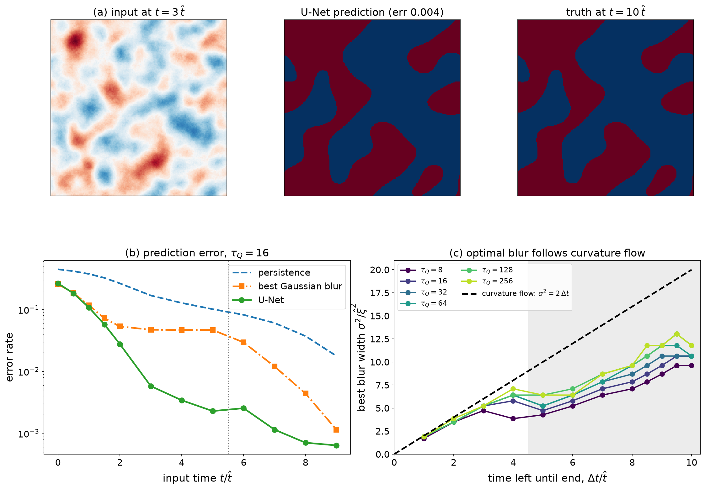
  <br>
  <em>(a) From an early, noisy field (t = 3 t̂), the U-Net predicts the domain pattern at the end of the run.
  (b) Prediction error vs. input time: the U-Net beats both baselines, most around domain formation (dotted line).
  (c) After formation, the optimal blur width follows the curvature-flow prediction σ² = 2Δt for all quench rates (shaded: before formation).</em>
</p>

# Background


<p align="center">
  
  <br>
  <em>The minima of the double-well potential spontaneously takes on a non-zero value as the parameter ε(t) is varied.</em>
</p>
Phase transitions in physical systems are associated with a spontaneous symmetry breaking. For instance, consider the figure above. On the left, we see that the minimum of the curve in red is in the center. Now imagine we deform the curve as shown in the diagram. We see that suddenly, there are now two minima in the function where previously there was only one. 

The red curve represents our systems potential energy. Our system is described by a "state", represented by the blue ball. Imagine we place the ball into the curve and let it go. We see in the first picture on the left that there is only one place we can put it so that the ball does not roll, and that is at the minimum of the potential energy curve. A system sitting at the minimum of a potential enjoys stability. This minimum energy state is called the ground state of the system. 

When there are two degenerate minima, the ball has to pick one to fall in. Both divots lower the balls potential energy by the same amount, so there is priority for which one should be chosen over the other, however a *choice must be made*. While a ball put the left well and a ball put in the right well are going to experience the exact same physics, their configurations are distinguishable (by their $x$ component, for instance). 

If we place the ball at the center of the minimum as in the left case in the figure above, the moment when the potential energy develops two separate minima the ball must make a choice as to which well it will occupy. This is why we call it spontaneous symmetry breaking, because the symmetry is broken spontaneously! 

The critical point of a system is the point at which symmetry is just about to be broken (e.g. the critical Temperature, critical magnetic field, etc). At this point, the system becomes ultra-sensitive to thermal fluctuations (The situation is slightly different in quantum systems, which we do not consider here). The change in the value of the field at one point has immense influence on the strength of the field at a far away point. To describe this long range sensitivity, we say that the system's *correlation length* "diverges" at the critical point, in other words, we formally say it is infinite. The correlation length of a second order phase transition obeys a scaling law, $\xi \propto| \Delta|^{-\nu}$, where $\Delta$ is the distance from the critical point and $\nu$ a number greater than 0.

Correlation length can be thought of as the size of an area that has settled into the same value of field strength. However, to equilibriate an area of size $\xi$, one needs to wait a period of time proportional to $\xi^z$. $z$ is the *dynamical exponent* of the system and is always greater than 0. This means that if our correlation length is infinite, then we need to wait an infinite amount of time for our system to equilibriate! 

<p align="center">
  
  <br>
  <em>The transition of some general disordered model to some crystalline phase. The blue line denotes how long one needs to wait for thermalization. The red lines indicate the cooling rate. The x value at which these two curves intersect is known as the "freezeout time" t̂. The classical understanding of KZ mechanism is that dynamics is "frozen out" in the time t ∈ [−t̂, t̂]</em>
</p>

This implies that any finite speed phase transition (in other words, you drive the system across the critical point in some time that doesn't take an infinite amount of time) is inherently a non-equilibrium process. Physically, heat energy is injected into the system by the finite speed quench. This heat is observable in the post-quench field configuration as topological defects that raise the energy of the system above its ground state. 

The density of these topological defects famously follows a power law, $\xi\propto v^{-\nu/(1+\nu z)}$, where $v$ is the velocity of the quench. By measuring the correlation length as a function of quench velocity, we can find the value of the exponent $\frac{\nu}{1+\nu z}$. This allow us to get equilibrium scaling exponents out of a non-equilibrium quench experiment!

We study a $\phi^4$ model with the following Lagrangian:

$$\mathcal{L}=\frac{1}{2}\dot \phi^2 -\frac{1}{2}(\nabla \phi)^2-V(\phi)$$

with 

$$V(\phi)=\frac{1}{8}(\phi^4-2\epsilon(t)\phi ^2)

$$

Noise and temperature require an outside bath, which is modeled through a Langevin extension to the equations of motion:

$$\ddot \phi + \eta \dot \phi - \nabla^2 \phi +V'(\phi)=\zeta(r,t)$$

Where $\zeta$ is our noise kernel satisfying:

$$\langle \zeta(r,t) \zeta(r',t') \rangle =2\eta \theta \delta^d(r-r')\delta(t-t')$$

The parameter of interest here is $\epsilon(t)$, which controls whether or not $V(\phi)$ has one or two minima (In fact, $V(\phi)$ is exactly the double well potential in the image above!)

We choose $\epsilon(t)=t/\tau$. We run an experiment from $t=-2\tau \to 10\tau$, which varies $\epsilon$ from -2 to 10 at a constant velocity $v=1/\tau$.

The above schematic of the KZ effect is quite general. In two dimensions, we can also have coarsening dynamics, where regions of phase set by the KZ mechanism, but then after this formation they can move, shrink, or grow. Oftentimes, anything that goes beyond mean-defect density is considered "beyond KZ physics". In this case, we aim to predict the entire field configuration, which is definitely beyond KZ physics!


# Results
### 1D replication study

We aim initially to replicate the results of [1]. We simulate the dynamics of the system in one dimension and train a Recurrent-Neural-Network to take in a time-window of the field and predict the final field configuration.

As a validation of our program, we choose numbers consistent with [1], chiefly that we three $\tau$ values, and our input windows are eleven snapshots separated by time units of $\delta t=1$. 


The one dimensional field starts off with a mean amplitude of zero, but grows with $\epsilon$. Defects are counted as zero-crossings of the field. It is the frustration energy between positive and negative domains that increases the total energy of the system. 

<p align="center">
  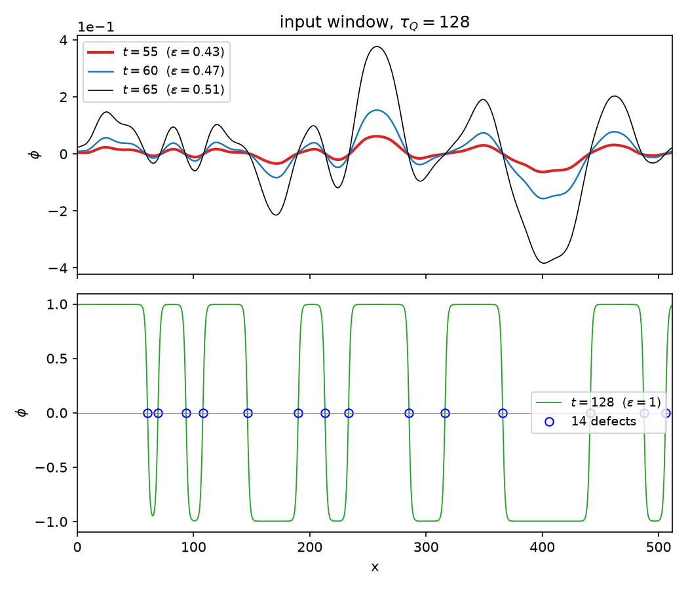
  <br>
  <em>Top: The real time evolution of the one dimensional field φ for a specific noise realization. Regions of positivity and negativity are evidence of the KZ dynamics. These regions grow increasingly polarized as the minimum depth ∝ √ε is increased. Bottom: The final field configuration for this trajectory, with defects counted as zero-crossings of the field. The job of our RNN is to predict the bottom plot given the top plot.</em>
</p>


You can train the model yourself, using `notebook/01_1d_replication.ipynb`. In our training, we find the RNN is able to predict the final field strength and values, as well as accurately predict the location of defects as reported first in [1].


<p align="center">
  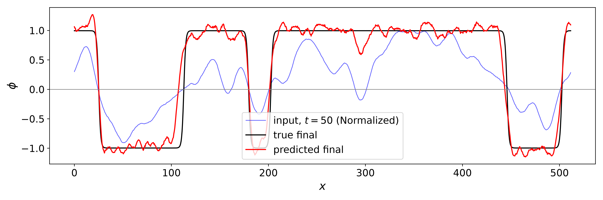
  <br>
  <em>The (normalized) field input in blue, the true final field in black, and our RNN's prediction of the final field in Red. As we can see, the model is not only capable of learning the final number of defects, but is also capable of predicting defect location!</em>
</p>


<p align="center">
  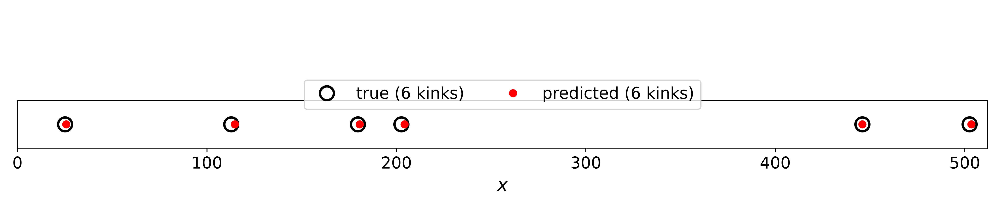
  <br>
  <em>Location of defects versus the prediction by the model</em>
</p>

In direct comparison with many of the figures in [1], we find that we replicate their results to a sufficient level of satisfaction. For instance, observe the training/validation curves we recover to the ones reported by them. We purposely choose numbers that are identical to theirs for validation purposes. 

<p align="center">
  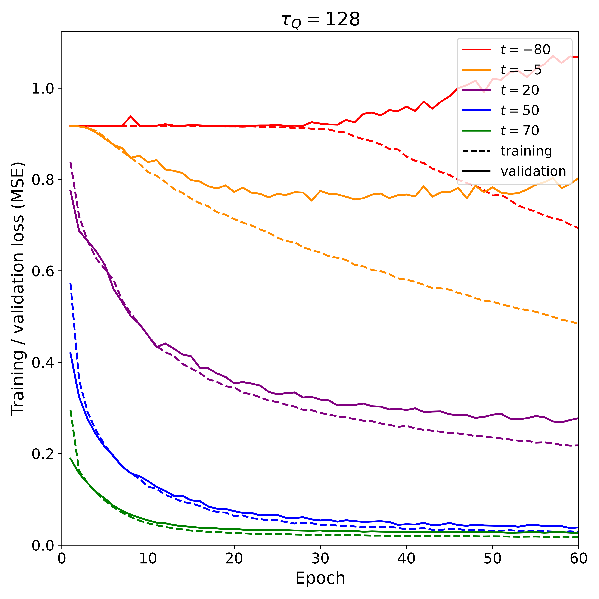
  <br>
  <em>Training (dashed) and validation (solid) loss for different input times t, τ<sub>Q</sub> = 128.
  Compare with Fig. 4 of Suzuki, Li & Zurek [1].</em>
</p>
### Going Beyond the paper

One simple question that follows from this study: What is the model really learning? 

To help answer this question, we apply a low-pass filter to the inputs before asking our model to predict the final field values. KZ physics tells us that length scales less than $\hat \xi$ (and hence, wavenumbers larger than $k=\frac{1}{\hat \xi}$) should be irrelevant to the final field configuration.

In applying a low pass filter, we are selecting to keep only wavenumbers $k\in [0,k_c]$ where $k_c$ is a cutoff frequency.


We find that for $k_c\le \frac{1}{\hat \xi }$, validation error greatly increases, but for $k_c\ge\frac{1}{\hat \xi}$ is flat! The information in the system lives at scales greater than $\hat \xi$. 


<p align="center">
  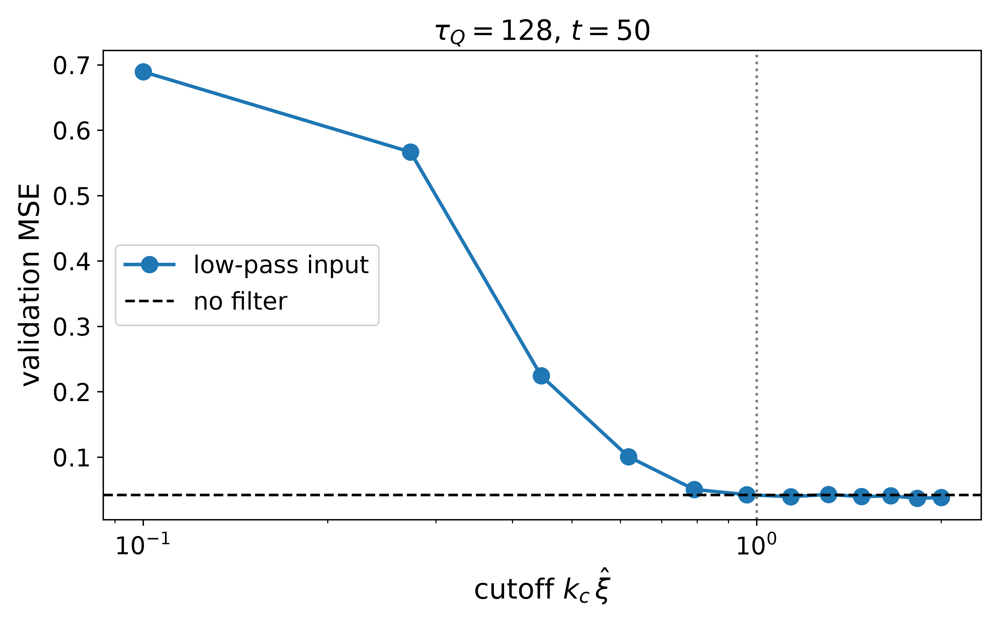
  <br>
  <em>Validation errors against k<sub>c</sub> cutoff frequency.</em>
</p>


## 2D Kibble Zurek Physics

In two dimensions, there are different dynamical constraints at play in the evolution of the system. Now, domains form as two-dimensional areas with defects serving as the walls.

This can be seen in the animation at the top of this page. In our study, we look at systems of size $256 \times 256$ with quench times $\tau_q \in [8,256]$. We generate $2000$ quenches for each value of $\tau$ which we believe is sufficient for the model to learn. We train the model to predict the the signs of $\phi$ at $t=10 \hat t$. 

In two dimensions, defects now are domain walls which can be thought of as the lines separating the phases. We check that these obey the Kibble-Zurek scaling numerically:


<p align="center">
  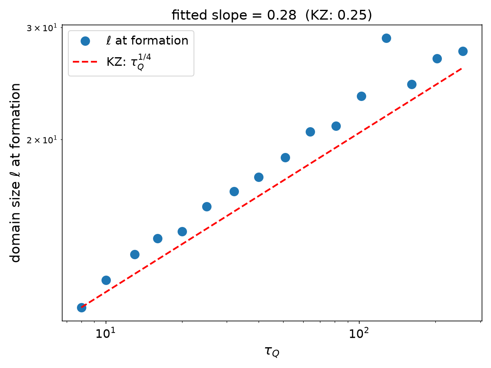
  <br>
  <em>Kibble-Zurek scaling of domain wall formation in the system. THe fitted slope of 0.28 is in good agreement with the theoretical value of 0.25. </em>
</p>


As a way to quantify the error of a model, we define  "persistence". This is error associated with taking the configuration at a given time and assuming that all sites will keep their current sign to the end of the evolution. It is the error that we get assuming nothing else will happen. It forms the baseline that any predictive model should try to beat. 


<p align="center">
  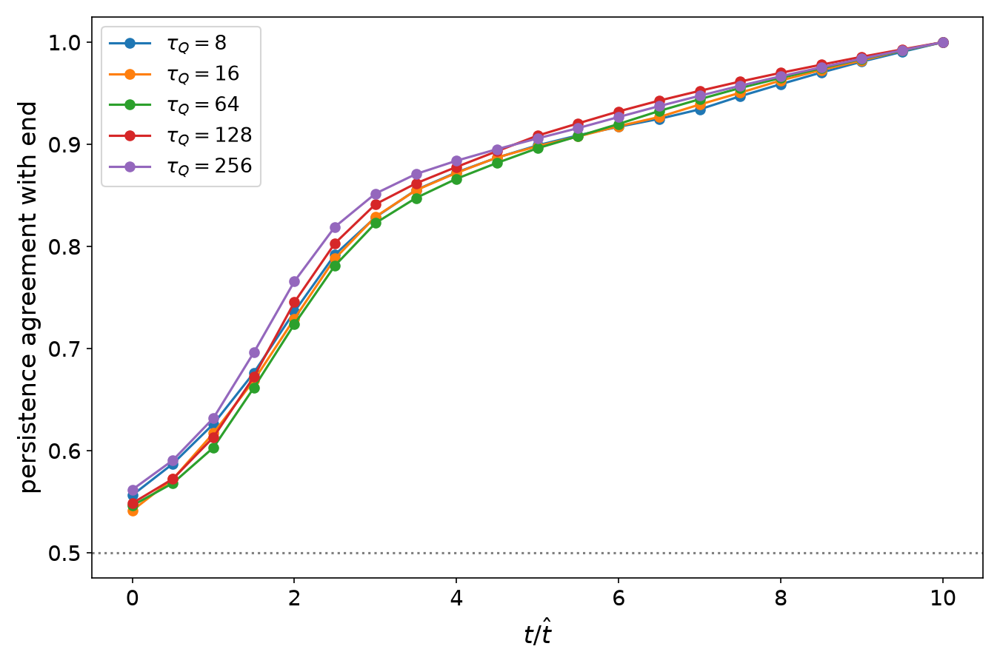
  <br>
  <em>Persistance has a near-collapse over rescaled time units, indicating the impulse regimes are universal across quench time. </em>
</p>

Finally, we note that in the study the largest quench times $\tau=128, 256$ are associated with with KZ domains that at the end of their evolution are large compared to the system size. We include the results from their quench experiments but note that the bulk of our focus will be on smaller quenches to avoid issues of finite system size. 

## Machine Learning on the 2D model

We define a guassian kernel with width $\sigma$:

$$G_\sigma (r) = (2\pi \sigma^2)^{-1} e^{-r/w\sigma^2}$$


One very crude model of domain formation is through simple diffusion that can be modeled by using the above guassian to blur the field. Suprisingly, such a simple model does well even in incredibly disordered cases. By scanning $\sigma$, we find that the optimal blurring follows $\hat xi$. For more details on this from a fourier perspective, see `03`.

After domains have formed, the optimal blurring parameter obeys $\sigma^2=2\Delta t$ where $\Delta t$ is the time remaining in the quench. This is a result indicative of diffusion dynamics. 
<p align="center">
  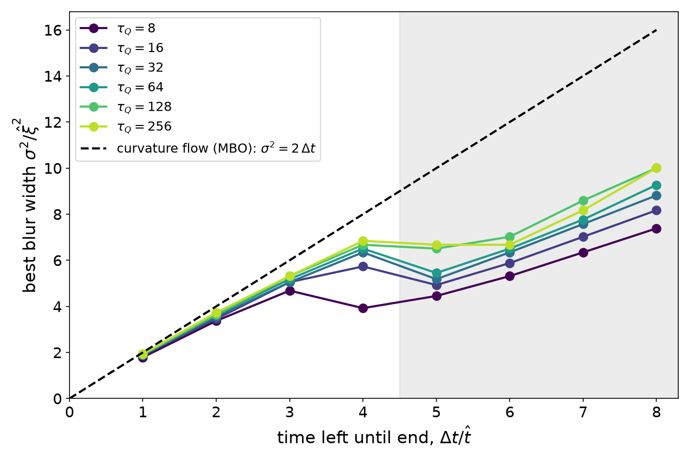
  <br>
  <em>Diffusive dynamics begin domains have already formed. </em>
</p>


<p align="center">
  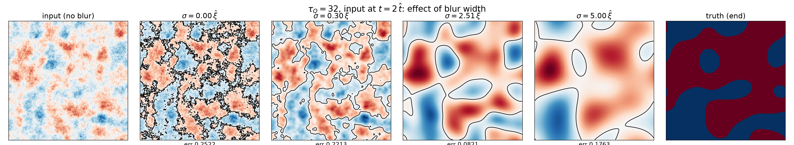
  <br>
  <em>Effects of the blurring parameter on field compared to the final domain distribution. A Gaussian blur filter can reduce error in even a very disordered state. </em>
</p>

### U-Net Comparison

<p align="center">
  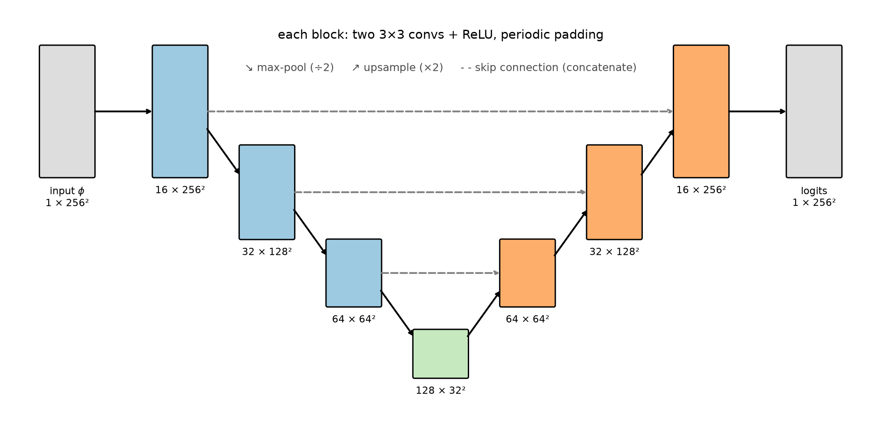
  <br>
  <em>Schematic of the U-Net model employed in this study. </em>
</p>


We trained a U-Net model on input images at specified timesteps of $\hat t$ to predict the final field domain pattern.


We directly compare the error of the best-blur filter with the fitting results of our U-Net model. We find, surprisingly, that it appears that the U-Net simply learns the optimal guassian blur at early times in the evolution. I.e. that the best model for final sign pattern at early times is diffusive dynamics. We note that the training of the model only included single snapshot images, and that absent of momentum information diffusive dynamics may be the only physics one can rely on to predict the final field configuration. However it does seem that the model is learning genuinely new physics, as we can see that while the Guassian Blur plateaus in every quench experiment, the U-Net is capable of reducing error by an order of magnitude beyond the blur. At late times, the blur once again becomes the optimum physics as with short timescales field dynamics can almost always be approximated through diffusion. 


<p align="center">
  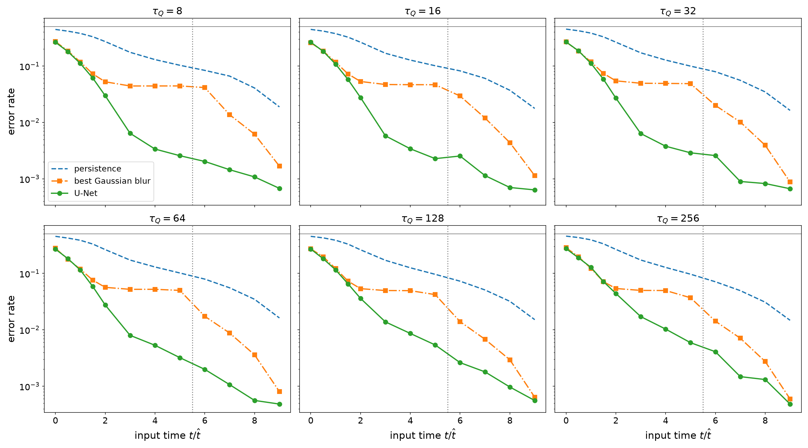
  <br>
  <em>We compare the baseline error (blue) to the diffusive filter (orange) and our model (green). We see that the filter plateaus in its ability to predict the dynamics where the model is able to learn to predict the final distribution. At very disordered cases, the model can only learn the filter itself.  </em>
</p>


<p align="center">
  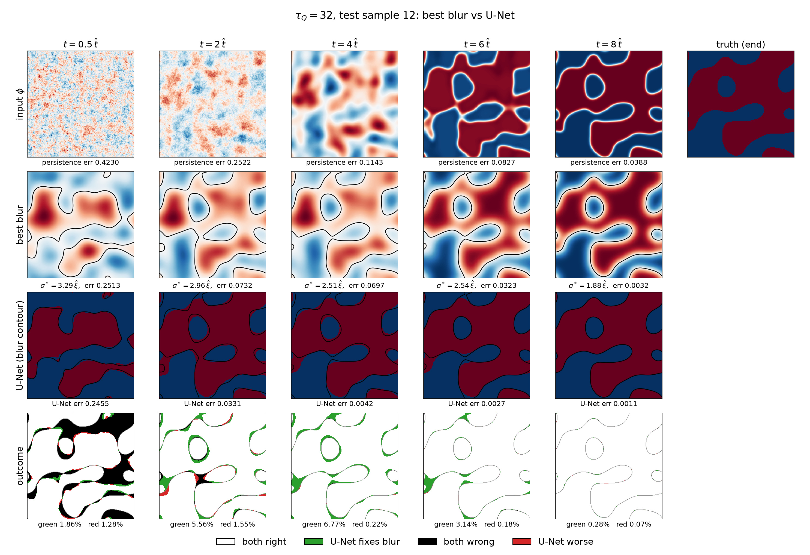
  <br>
  <em>A comparison of the guassian blurring with predictions from the U-Net. In the bottom row, areas shaded in black are regions both models got wrong, in green, regions that U-Net predicted correctly but the blurring did not, and red the opposite. We see that U-Net and guassian blurring are almost identical at early times in performance and hold no edge over one another, but at intermediate times the U-Net is better able to capture the contours of the domain formations than the blurring is.  </em>
</p>


## Impact of  Momentum

The input state configuration $\phi$ in the experiments above neglects the full phase-space coordinate of the field by ignoring the field momentum $\pi$. It is natural to assume that the inclusion of more information, in this case the velocities of the fields through the phase transition, should correspond to a model that is capable of learning more. However, in overdamped systems momentum is suppressed quickly and over long timescales the end state of the system has very little memory of early momenta. To explore the role that momenta plays, we ran the same experiment for a case of $\tau=4$ for three values of $\eta$, the damping parameter. 

We trained the U-Net on the full state phase configuration $(\phi,\pi)$ and compared the results, which are plotted below. We see a modest increase at earlier times that grows as the damping parameter is decreased, indicating that in systems with higher damping the final configuration is primarily a function only of a snapshot of the system.  At later times, after the impulse regime, the phase configurations are quite fixed and knowledge of the (relatively small) momenta are not useful.


<p align="center">
  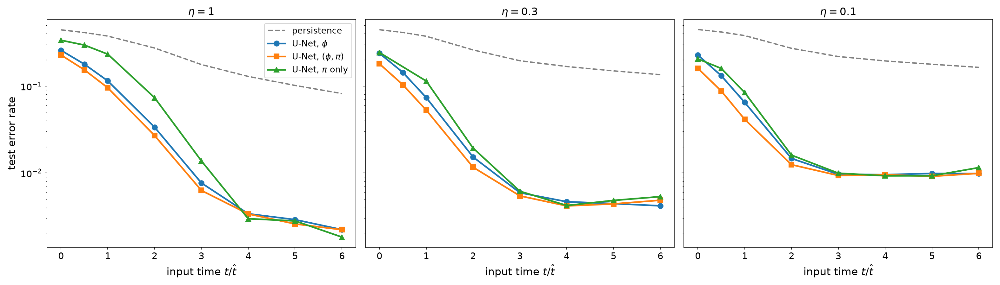
  <br>
<em>Test error vs input time: persistence, U-Net on φ, U-Net on (φ, π), and U-Net on π alone.</em>
</p>

Below we plot a comparison of the correlation between the fields and the relative error reduction gained by including momentum in training. As the fields become increasingly correlated, the amount of new information momentum gives to the system decreases. 


<p align="center">
  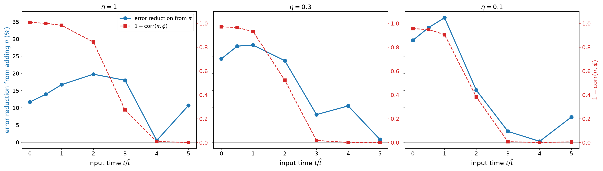
  <br>
  <em>Error reduction from π vs 1 − corr(π, φ), per damping value.</em>
</p>


We also trained the model purely on the $\pi$ field, and found similar results to training only on the $\phi$ component. This indicates that even in stuations where the momentum and field are uncorrelated, they can still predict the same KZ physics.

### Examining the 1D case with momentum

<p align="center">
  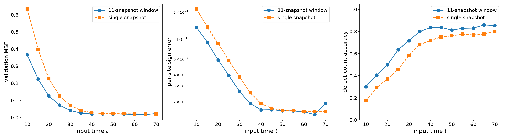
  <br>
  <em>1D: 11-snapshot window vs single snapshot (normalized inputs).</em>
</p>

Going back to the one dimensional case studied in [1], we observe a similar behavior in the error from considering multiple snapshots (as they did in their study) compared to a single snapshot. We see that again, while momentum grants moderate reduction in error in the impulse regime, afterwards the field configurations are fixed and there is not much to be gained through additional training.


# Next steps and open questions
-> Exploration of NN architecture: While U-Net is a natural starting place for correlated image data, is it the optimal model? Could more sophisticated models learn deeper physics? Similarly, an analysis of hyper parameter scalings might let us ultimately save on computing resources.

-> Response to non-homogenous quenches:
What if heat is injected only into some areas of the lattice? Can we train a model to learn the dynamical behavior of these deeply non-equilibrium configurations?

-> More complicated models:

Models such as the Potts Model exhibit $Z_3$ symmetry breaking, meaning that instead of domains of $1,-1$ they form domains of $1, e^{i2\pi/3}, e^{i 4\pi /3}$. Furthermore, these types of models are known to have extensions where the physics is more subtle, for instance slight energy imbalances in the broken symmetry states that give preference to one type of defect over another. A NN ability to learn the dynamics of such a model would give insight into their phase transitions.

## Repository Structure

```
MachineLearningKZ/
├── src/                      # core library, imported by everything else
│   ├── kz.py                 # 1D Langevin φ⁴ solver (+ 1D data loading)
│   ├── kz_2d.py              # 2D Langevin φ⁴ solver and diagnostics
│   ├── kz_ml.py              # 2D U-Net, data loading, training and evaluation
│   └── analysis.py           # loading results/models, predictions, wall measures
│
├── scripts/                  # command-line programs (run from the repo root with python -m)
│   ├── kz1d/
│   │   └── generate_data.py  # 1D quench dataset
│   └── kz2d/
│       ├── generate_data.py  # one chunk of 2D quench data
│       ├── train.py          # train one U-Net (one τ_Q, one input time)
│       ├── kz_scaling.py     # domain size at formation vs τ_Q
│       ├── inspect_chunk.py  # quick visual check of a data chunk
│       └── kz_animation.py   # the animated GIF at the top of this README
│
├── jobs/                     # SGE batch scripts for the BU SCC cluster
│   ├── gen2d.sh              # 2D data generation (array job)
│   ├── train.sh              # U-Net training (array job, GPU)
│   └── train_grid_*.txt      # (τ_Q, t, target) combinations for train.sh
│
├── notebooks/                # the analysis, in reading order
│   ├── 01_1d_replication.ipynb
│   ├── 02_2d_kz_physics.ipynb
│   └── 03_ml_analysis.ipynb
│
├── momentum_exp/             # self-contained experiment: does momentum π help prediction?
│   ├── generate.py, train.py # data (φ and π) and training (φ vs (φ, π))
│   ├── gen.sh, train.sh      # cluster jobs
│   ├── analysis.ipynb        # results
│   └── results_eta*/         # one folder per damping η
│
├── results/
│   ├── v2/                   # current 2D training results (one JSON per run)
│   ├── v1/                   # superseded first pass, kept for reference
│   └── kz_scaling.json       # output of scripts/kz2d/kz_scaling.py
│
├── figures/                  # figures used in this README and the notebooks
└── requirements.txt
```

Simulation data (`data/`) and trained weights (`*.pt`) are not included; see **Reproducing the results** to regenerate them.
## Installation

Tested with Python 3.12.

```bash
git clone https://github.com/KristianMunnikhuis/MachineLearningKZ.git
cd MachineLearningKZ
conda create -n mlkz python=3.12
conda activate mlkz
pip install -r requirements.txt
```

All scripts are run **from the repository root** with `python -m`, so that `src/` is importable.

## Reproducing the results

Simulation data and trained model weights are not included in the repository (the 2D dataset is ~34 GB).
The training *results* (one JSON per run, in `results/`) are included, so the error and training-statistics
plots in the notebooks can be made without retraining. Everything else needs the steps below.

### 1. 1D data ( ~10 min per τ_Q on M1 Macbook Pro)

```bash
python -m scripts.kz1d.generate_data 128
```

Then run `notebooks/01_1d_replication.ipynb`; the 1D networks are trained inside the notebook.

### 2. 2D data (cluster)

Each τ_Q is 40 chunks × 50 quenches = 2000 samples. On an SGE cluster:

```bash
for tau in 8 16 32 64 128 256; do
  qsub -v TAU=$tau -N kz2d_$tau jobs/gen2d.sh
done
```

One chunk takes ~10 min (τ_Q = 8) to ~2 h (τ_Q = 256). The job script uses the Boston University SCC settings
(project name, modules); adapt the header lines for other clusters.

### 3. KZ scaling

```bash
python -m scripts.kz2d.kz_scaling
```

Writes `results/kz_scaling.json`, used by notebook 02.

### 4. Train the U-Nets (cluster, GPU)

For training the U-Net, we use computing resources of the Boston University SCC. One model per (τ_Q, input time) takes about 7 minutes on a GPU.

```bash
qsub -t 1-48 -v GRID=jobs/train_grid_y_end.txt jobs/train.sh
qsub -t 1-24 -v GRID=jobs/train_grid_early.txt jobs/train.sh
```

Writes `results/v2/*.json` (metrics and training history) and `*.pt` (weights).

### 5. Notebooks

Run in order: `02_2d_kz_physics.ipynb`, then `03_ml_analysis.ipynb`. Cells that show individual
quenches or model predictions need one data chunk per τ_Q (`data/2D_v2/tau<τ>/chunk_000.npz`)
and the trained weights.

# Contact
I am a graduate student at Boston University advised by Anatoli Polkovnikov who is interested in statistical analysis and physics modeling. I can be reached by my school email:

Kristian Munnikhuis
kmunnik@bu.edu


I am always interested in connecting and working on interesting projects. Please, reach out!

## References

1. F. Suzuki, Y. W. Li, and W. H. Zurek, *Machine learning topological defect formation: When are the defects made?*,
   [arXiv:2508.20347](https://arxiv.org/abs/2508.20347) (2025; v2 2026). Accepted in Phys. Rev. Lett.
2. T. W. B. Kibble, *Topology of cosmic domains and strings*, J. Phys. A: Math. Gen. **9**, 1387 (1976).
3. W. H. Zurek, *Cosmological experiments in superfluid helium?*, Nature **317**, 505 (1985).
4. W. H. Zurek, *Cosmological experiments in condensed matter systems*, Phys. Rep. **276**, 177 (1996).
5. A. del Campo and W. H. Zurek, *Universality of phase transition dynamics: Topological defects from symmetry breaking*,
   Int. J. Mod. Phys. A **29**, 1430018 (2014).

